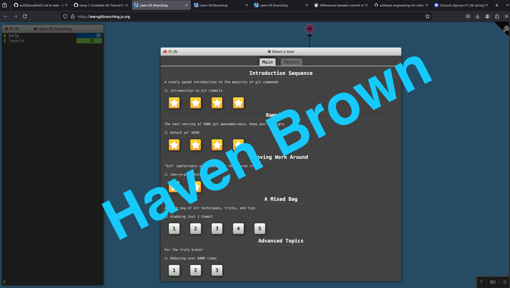
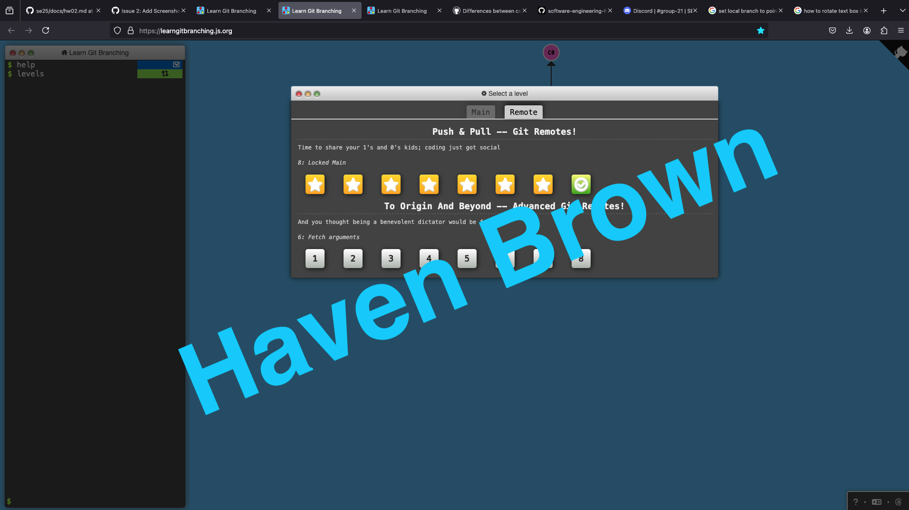

## 📝 Introduction

# Stage all changes for commit
git add .

# Commit the staged changes with a message
git commit -m "Add changes"

# Push to the remote repository
git push origin YOUR_BRANCH

- [ ] Task 1
- [x] Task 2

# Tutorial Progress

