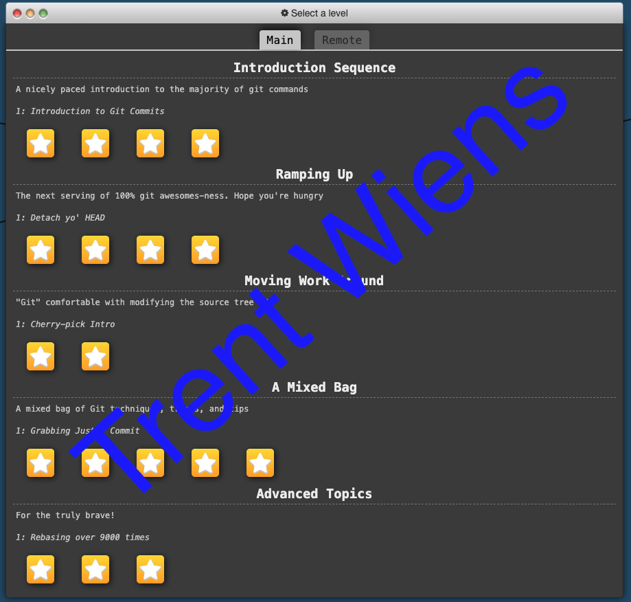
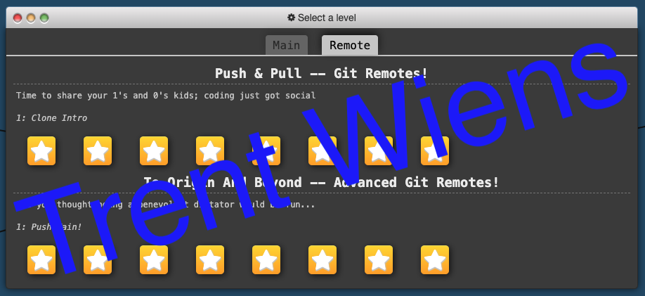

## Introduction

# Task List

- [x] Complete Git Tutorial
- [x] Add screenshots to [README.md](README.md)
- [x] Modify [.html](index.html) file
- [x] Merge latest changes
- [ ] Review pull requests

# git-homework2

